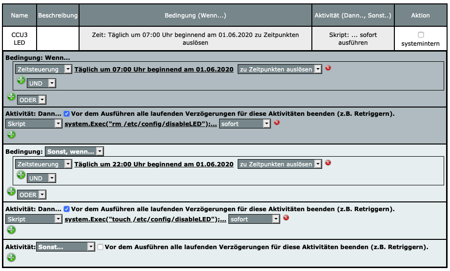
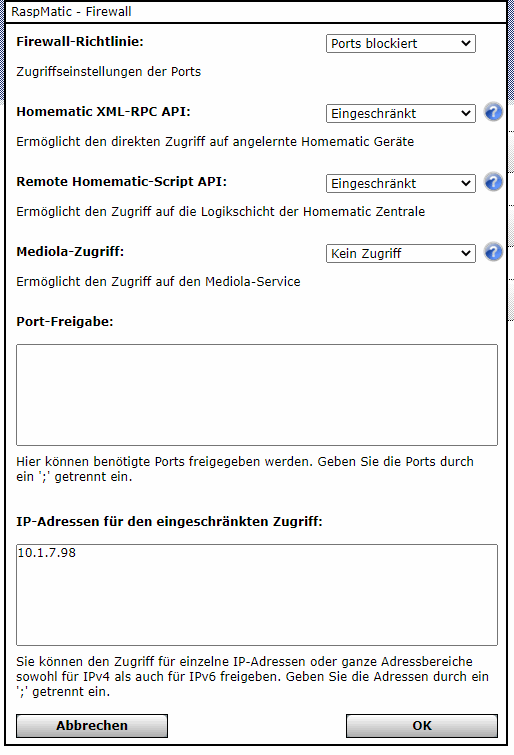

# Dokumentation

## SmartHome mit Raspberry Pi 4 als Zentrale


## Anleitungen
- Hardware und Installationen
  - Zusatzhardware
    - Gehäuse Argon ONE
    - 19" Einbau    
      - [19 inch rack mount 1U for 1-4 pcs of  RASPBERRY Pi + 3x blank cover](https://amzn.to/376T3FH)  
      - [Monoprice Patchpanel](https://amzn.to/2Y9k07t)  
      - [Pi-Einschub zum selberdrucken](https://www.thingiverse.com/thing:3845551)
      - [SSD-Halterung zum selberdrucken](https://www.thingiverse.com/thing:3126622)
    - POE-Hat
      - Pi Foundation  
        [POE-Hat](https://www.raspberrypi.org/products/poe-hat/)  
        [Stapelleiste](https://amzn.to/3eZvVvw)
      - DSLR-KIT
    - LED
    - OLED  
      [OLED bei Amazon](https://amzn.to/2MeAtls)
  - Grundsystem mit Rasbian
    - SD
    - SSD
  - Homematic mit Raspberrymatic  
  
    ##### LED ein-/ausschalten
    *Programme & Verknüpfungen => Skript testen*
    ```
    system.Exec("rm /etc/config/disableLED");
    system.Exec("touch /etc/config/disableLED");
    ```
    *Einstellungen => Systemsteuerung => Allgemeine Einstellungen => Info-LED*  
    Servicemeldungen  
    Alarmmeldungen  
    *Programme & Verknüpfungen => Neu*  
    
    ##### Firewall
    Einstellungen => Systemsteuerung => Firewall konfigurieren
    
    
    
    ##### Update-URLs
    
    |CCU|URL
    |---|----
    |ccu2|https://update.homematic.com/firmware/download?cmd=js_check_version&version=2.22.22&product=HM-CCU2&serial=NEQ7777777
    |ccu3|http://update.homematic.com/firmware/download?cmd=js_check_version&version=3.22.22&product=HM-CCU3&serial=NEQ7777777
    |RaspberryMatic|https://raspberrymatic.de/LATEST-VERSION.js
    |pivccu2|https://www.pivccu.de/pivccu.latestVersion
    |pivccu3|https://www.pivccu.de/pivccu3.latestVersion
    |debimatic|https://www.debmatic.de/latestVersion
    |testing_pivccu|https://www.pivccu.de/pivccu.latestVersion
    |testing_pivccu3|https://www.pivccu.de/pivccu3.latestVersion
    |testing_debimatic|https://www.debmatic.de/latestVersion

    
  - Pi-Hole
  - ioBroker
  - USV  
    [USV mit ioBroker](https://bloggerbu.de/usv-iobroker/)
  
- Flashen von China-Cloud-Geräten
  - Tasmota
    - Flashen mit Stick
    - OTA-Flashen
  - Gosund Zwischenstecker SP111
  - Gosund WLAN-Lampe WB3
  - LVWIT WLAN-Lampe A70-3
  
### ioBroker

## Resourcen
- https://www.bytebee.de/raspbian-installieren/  
- https://ownsmarthome.de/2019/12/07/tasmota-mit-tuya-convert-over-the-air-flashen/  
- https://www.verdrahtet.info/2020/03/06/tasmota-flashen-ota-update/  
- https://www.youtube.com/watch?v=Z8PDWtepEjE&list=WL&index=45  
- https://www.verdrahtet.info/2020/05/22/raspberry-pi-4-von-ssd-booten-ganz-ohne-sd-karte/  
- https://github.com/raspberrypi/rpi-eeprom/tree/master/firmware/beta  
- https://jensmueller.one/amazon-link-generator/
- https://www.trojaner-board.de/96344-anleitung-cleanup-massnahmen-absicherung-rechners.html#post627442
- https://github.com/Baenker/Pruefung-CCU-Firmware/blob/master/CCU-Firmware.js
  
